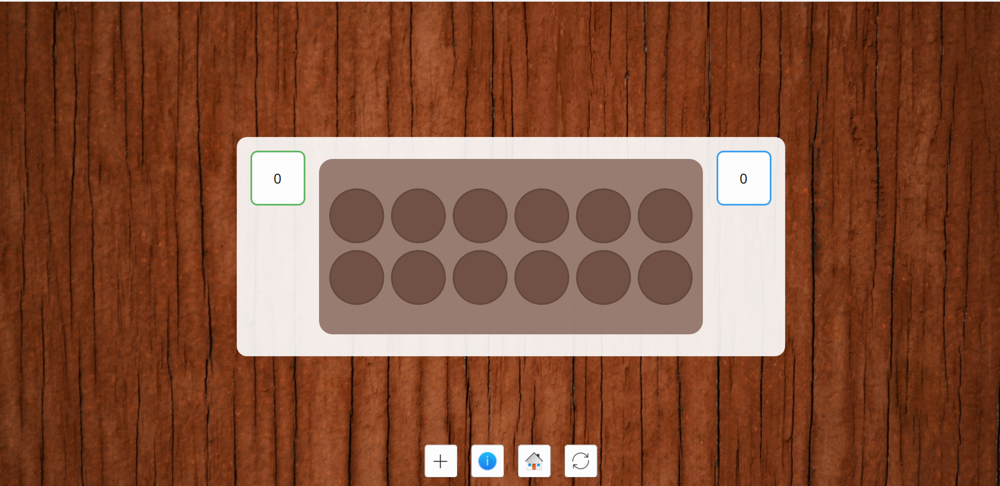

Hello again :) 

## 🌟 Week 3–4 Progress
### ✨ The Story So Far:  
The past two weeks have been pretty packed — mid-semester exams were in full swing, and balancing that with project work was a bit tricky. Finding time to focus on both wasn’t easy, but somehow things started to fall into place.  

I made solid progress with the **Game Board** design, though it took a few iterations to get it right. Got some helpful feedback from my mentor, **Benson**, which pushed me to refine the layout and improve the overall flow. Connecting the backend with QML was a challenge, but once it clicked, things started coming together nicely.  

### ✅ Achievements:
- Designed the **Game Board** UI using **Kirigami** and **QML**.
- Connected the backend to QML.
- Successfully implemented two variants:
  - **Bohenspiel**  
  - **Oware**  

  
*Initial design of the game board.*

---

### 🚧 Challenges:
- Faced difficulties with the initial game board design. 
   
*Initial design of the game board.*

- Got valuable feedback from Benson  and made adjustments. 
- Redesigned the Board to better adjust with varying window width.
  

- Troubleshooting the backend connection with QML was tricky but rewarding!  
- Changed the flow of the game logic to better fit the QML structure.
  **Landing Page** → **Main Menu** → **Game Variant** → **Variant Rules** → **Play Game** → **Game End**

*Backend connection working with QML.*

---

### 🛣️ Next Steps: 
- Add support for additional game variants.  

---

